<h1 align="center">Hi 👋, I'm Gourav Jangra</h1> <h3 align="center"> Aspiring Software Engineer | 💻 Full Stack Developer | 🐍 Python Enthusiast </h3> 
  
 
  

👨‍💻 About Me

I'm a Computer Science student and aspiring Software Engineer who enjoys building real-world applications and exploring new technologies.

🎓 Computer Science Student
💻 Interested in Full Stack Development
☕ Passionate about Java & Backend Development
🐍 Exploring Python and Automation
🧠 Practicing Data Structures & Algorithms
📊 Learning Data Analysis & Power BI
🚀 Goal: Become a skilled Software Engineer
🔥 Always learning and improving
🛠️ Tech Stack
💻 Programming Languages

  
   
🌐 Web Development

    

🗄️ Database

  

⚙️ Backend & Tools

     

📂 What I Build
Real-world Java & Web Development applications
GUI applications using Java Swing & JDBC
Web-based applications
Problem-solving and logic-building projects
Data analysis and visualization projects
Python automation projects
Currently Learning
Advanced Java Development
Data Structures & Algorithms
Python for Automation
Power BI & Data Visualization
Exploratory Data Analysis
Full Stack Web Development
GitHub Statistics

   
 

📈 Contribution Graph

  

🤝 Connect With Me

    

⚡ Fun Fact

When I'm not coding, I enjoy exploring new technologies and turning ideas into real projects.

<h3 align="center"> ⭐ Thanks for visiting my profile! </h3> 
 <i>Let's learn, build, and grow together 🚀</i> 

